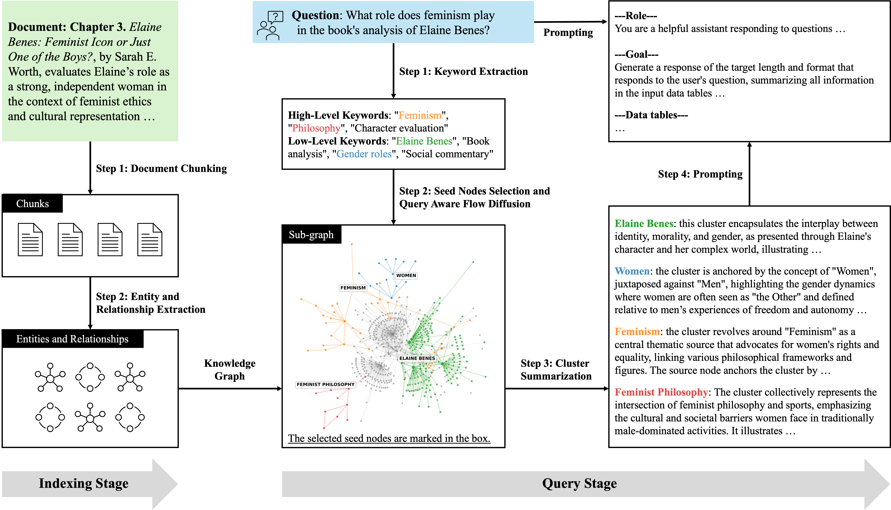

# QAFD-RAG: Usage Guide

## 1. Installation

Make sure you have Python 3.8+ and install the required dependencies using the provided requirements file:

```
pip install -r requirements.txt
```

## 2. Basic Usage

### 2.1. Select LLM and Set API Key

Before using QAFD-RAG, you need to select your LLM provider and set the corresponding API key. For example, to use OpenAI:

```python
import os
os.environ["OPENAI_API_KEY"] = "your-openai-api-key"
```

### 2.2. Import and Initialization

```python
from QAFDRAG import QAFDRAG, QueryParam

# Initialize the RAG system (choose your storage backends as needed)
rag = QAFDRAG(
    working_dir="./QAFDRAG_cache",  # Directory for cache and storage files
    kv_storage="JsonKVStorage",     # Key-value storage backend
    vector_storage="NanoVectorDBStorage",  # Vector DB backend
    graph_storage="NetworkXStorage",       # Graph storage backend
    # You can customize other parameters if needed
)
```

### 2.3. Ingest Documents

You can insert a single document or a list of documents (strings):

```python
rag.insert("Your document content here.")
# or
rag.insert([
    "First document content.",
    "Second document content."
])
```

This will:
- Chunk the documents by token size
- Extract entities and relationships
- Build/update the knowledge graph and vector DB

### 2.4. Querying

To ask a question, use the `query` method. You can control the retrieval mode and other options via `QueryParam`:

```python
param = QueryParam(mode="hybrid")  # Options: "local", "global", "hybrid", "combined"
answer = rag.query("What is the relationship between X and Y?", param)
print(answer)
```

**Modes:**
- `"local"`: Focuses on fine-grained, entity-level context
- `"global"`: Focuses on high-level, thematic context
- `"hybrid"`: Combines both local and global

You can also adjust other parameters in `QueryParam` (see code for all options).

## 3. Example End-to-End Script

```python
import os
os.environ["OPENAI_API_KEY"] = "your-openai-api-key"

from QAFDRAG import QAFDRAG, QueryParam

rag = QAFDRAG(working_dir="./QAFDRAG_cache")
rag.insert("The Eiffel Tower is located in Paris and is a famous landmark.")
answer = rag.query("Where is the Eiffel Tower?", QueryParam(mode="local"))
print(answer)
```

## 4. Illustration

- 

Two-stage architecture of the QAFD-RAG framework. The indexing stage constructs a domain-specific knowledge graph by extracting entities, relations, and document-level structure from raw corpus data. The query stage processes an incoming user query in several steps: (1) keyword extraction identifies query-relevant dual-level keywords; (2) a query-aware flow diffusion algorithm propagates selected seed nodes over the graph based on semantic and structural signals; (3) clusters are collected for each seed node, and each cluster is summarized into natural language; and (4) cluster summaries, along with the original query, are passed to a language model for final response generation.

## 5. Numerical Results

Comparison of QAFD-RAG and baseline methods across five evaluation dimensions: Comprehensiveness, Diversity, Logicality, Relevance, and Coherence. Each score (0–100) is the average of five independent evaluations conducted using GPT-4o. The best score in each row is highlighted in bold.

### Cooking

| Metric | GraphRAG | LightRAG | PathRAG | QAFD-RAG |
| --- | ---: | ---: | ---: | ---: |
| Comprehensiveness | 86.23 (±7.00) | 82.11 (±7.56) | 87.26 (±8.02) | **89.25 (±3.82)** |
| Diversity | 79.10 (±8.72) | 74.97 (±9.46) | 81.87 (±8.68) | **83.42 (±5.25)** |
| Logicality | 90.79 (±2.68) | 87.49 (±5.82) | 90.20 (±5.97) | **91.35 (±2.73)** |
| Relevance | 95.14 (±2.91) | 92.27 (±5.88) | 93.60 (±8.24) | **95.45 (±2.83)** |
| Coherence | 90.63 (±1.75) | 87.98 (±4.09) | 90.56 (±4.10) | **91.58 (±2.04)** |

### Mathematics

| Metric | GraphRAG | LightRAG | PathRAG | QAFD-RAG |
| --- | ---: | ---: | ---: | ---: |
| Comprehensiveness | 84.30 (±9.52) | 80.93 (±8.44) | 85.83 (±7.46) | **87.30 (±4.94)** |
| Diversity | 77.46 (±10.68) | 74.07 (±10.40) | 81.11 (±8.15) | **82.56 (±6.09)** |
| Logicality | 88.91 (±8.29) | 86.30 (±6.20) | 88.83 (±7.43) | **90.04 (±5.15)** |
| Relevance | 92.65 (±10.34) | 90.77 (±8.26) | 91.62 (±10.23) | **93.36 (±7.24)** |
| Coherence | 89.04 (±7.52) | 86.29 (±4.56) | 89.67 (±4.20) | **90.37 (±3.16)** |

### Mix

| Metric | GraphRAG | LightRAG | PathRAG | QAFD-RAG |
| --- | ---: | ---: | ---: | ---: |
| Comprehensiveness | 82.76 (±11.41) | 78.72 (±13.12) | 84.66 (±6.34) | **87.15 (±3.46)** |
| Diversity | 74.94 (±11.68) | 70.97 (±13.39) | 78.86 (±6.51) | **81.15 (±4.86)** |
| Logicality | 88.45 (±6.95) | 85.72 (±7.00) | 88.81 (±5.62) | **90.70 (±2.93)** |
| Relevance | 92.81 (±8.65) | 90.37 (±9.36) | 92.39 (±8.55) | **94.36 (±4.50)** |
| Coherence | 88.90 (±3.34) | 86.26 (±4.68) | 89.16 (±3.63) | **90.36 (±2.07)** |

### Music

| Metric | GraphRAG | LightRAG | PathRAG | QAFD-RAG |
| --- | ---: | ---: | ---: | ---: |
| Comprehensiveness | 85.32 (±6.46) | 81.14 (±8.54) | 87.02 (±4.46) | **87.95 (±3.99)** |
| Diversity | 79.37 (±7.92) | 75.08 (±10.13) | 82.32 (±4.92) | **83.40 (±4.47)** |
| Logicality | 90.02 (±4.63) | 86.64 (±6.29) | 90.11 (±4.66) | **90.56 (±3.77)** |
| Relevance | **94.14 (±7.01)** | 91.29 (±8.41) | 93.90 (±6.34) | 94.08 (±5.46) |
| Coherence | 89.80 (±3.25) | 87.34 (±4.36) | 90.48 (±3.14) | **90.94 (±2.39)** |

### Philosophy

| Metric | GraphRAG | LightRAG | PathRAG | QAFD-RAG |
| --- | ---: | ---: | ---: | ---: |
| Comprehensiveness | 84.61 (±8.41) | 80.92 (±8.88) | 85.84 (±4.75) | **86.78 (±4.11)** |
| Diversity | 78.36 (±8.90) | 74.36 (±9.63) | 81.32 (±5.16) | **81.91 (±4.69)** |
| Logicality | 88.67 (±6.90) | 85.74 (±6.57) | 88.69 (±4.35) | **89.35 (±4.25)** |
| Relevance | 93.53 (±8.05) | 90.85 (±7.32) | 92.75 (±6.48) | **93.63 (±5.91)** |
| Coherence | 88.83 (±6.59) | 86.44 (±4.61) | 89.49 (±2.65) | **89.91 (±2.70)** |

### Physics

| Metric | GraphRAG | LightRAG | PathRAG | QAFD-RAG |
| --- | ---: | ---: | ---: | ---: |
| Comprehensiveness | 86.33 (±7.32) | 84.45 (±4.39) | 88.77 (±3.20) | **89.51 (±3.14)** |
| Diversity | 79.10 (±7.84) | 76.38 (±6.19) | 83.31 (±4.28) | **84.21 (±3.89)** |
| Logicality | 90.29 (±7.68) | 89.13 (±4.37) | **91.82 (±2.75)** | 91.77 (±3.26) |
| Relevance | 94.73 (±7.71) | 93.67 (±5.39) | 95.60 (±2.77) | **95.61 (±2.74)** |
| Coherence | 89.99 (±7.37) | 88.65 (±2.76) | 91.60 (±1.94) | **91.67 (±2.14)** |

---

**Acknowledgments:** The development of QAFD-RAG for question answering (QA) tasks utilizes techniques from [GraphRAG](https://github.com/microsoft/graphrag), [LightRAG](https://github.com/HKUDS/LightRAG), and notably [PathRAG](https://github.com/BUPT-GAMMA/PathRAG). Please refer to their respective repositories for technical details.