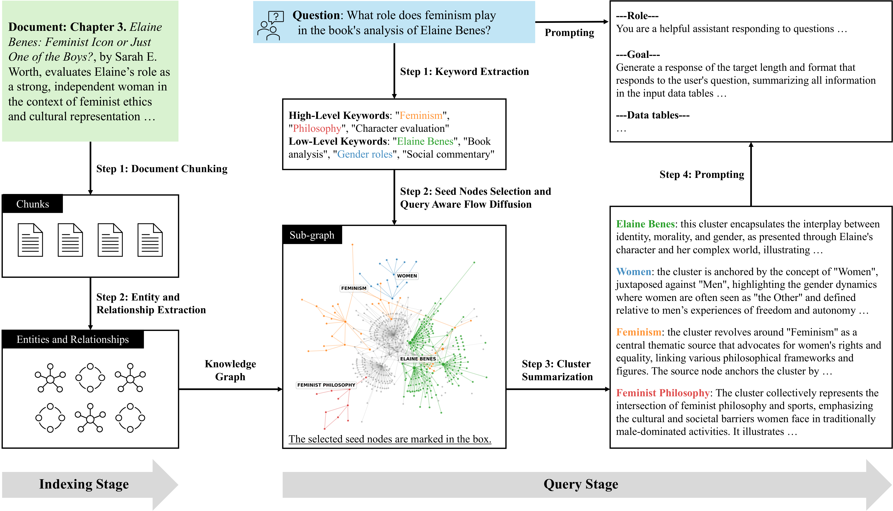

# QAFD: Code and Reproducibility Structure

This repository provides code for running and reproducing experiments on Query-Aware Flow Diffusion (QAFD) for:
- Question Answering with Retrieval-Augmented Generation (RAG)
- Text-to-SQL (natural language to SQL)

---



*Figure: Two-stage architecture of the QAFD-RAG framework. The indexing stage constructs a domain-specific knowledge graph by extracting entities, relations, and document-level structure from raw corpus data. The query stage processes an incoming user query in several steps: (1) keyword extraction identifies query-relevant dual-level keywords; (2) a query-aware flow diffusion algorithm propagates selected seed nodes over the graph based on semantic and structural signals; (3) clusters are collected for each seed node, and each cluster is summarized into natural language; and (4) cluster summaries, along with the original query, are passed to a language model for final response generation.*


## Directory Structure

```
QAFD/
├── QAFD_RAG/                    # Question answering (RAG) code and experiments
├── QAFD_text2sql/
│   ├── QAFD_snow/              # Text-to-SQL code and experiments
│   ├── baselines/              # Baseline methods for T2SQL
│   └── ...
├── README.md
└── .gitignore
```

---

## Usage

To **run or reproduce experiments**, refer to the detailed `README.md` provided in each subfolder:

- [`QAFD_RAG/README.md`](./QAFD_RAG/README.md):  
  Instructions for QAFD-RAG question answering, setup, and experiment reproduction.

- [`QAFD_text2sql/QAFD_snow/README.md`](./QAFD_text2sql/QAFD_snow/README.md):  
  Instructions for QAFD-based text-to-SQL experiments, schema extraction, pipeline usage, and SQL generation.

- [`QAFD_text2sql/baselines/README.md`](./QAFD_text2sql/baselines/README.md):  
  Running and evaluating baselines for text2sql tasks.

---
